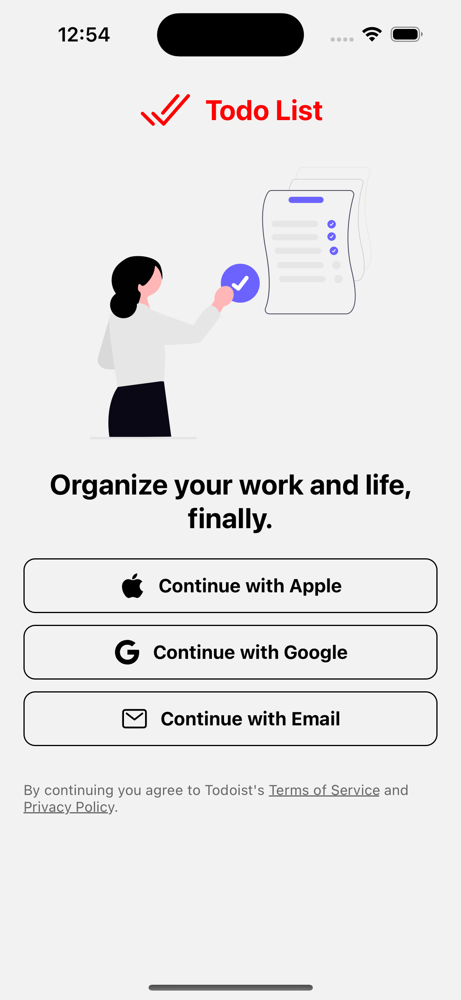
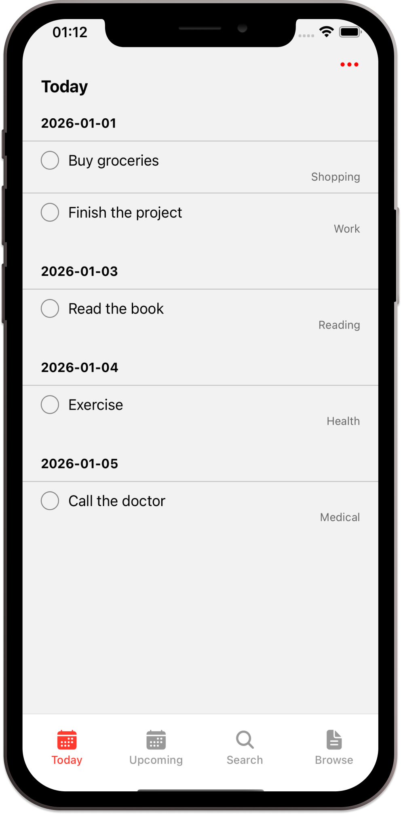
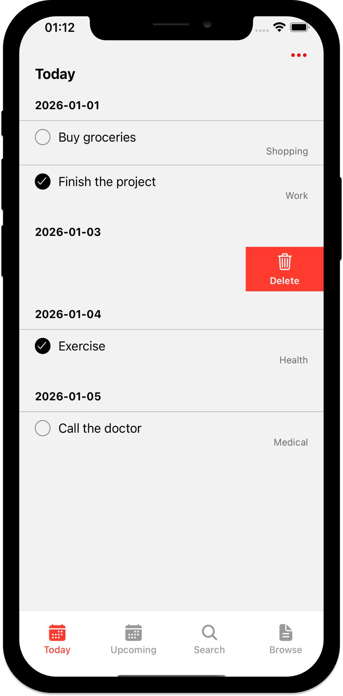

# Todoist Clone - React Native

A modern todo list application built with React Native and Expo, inspired by Todoist.

## Screenshots

  
  
  

## Setup

### Environment Setup

Make sure you have the Expo CLI installed.

Because we are using pre-built and a custom development client, you should download Android Studio and Xcode to your Mac. For more information on setting up your development environment, refer to the [Expo documentation for Android Studio](https://docs.expo.dev/development/build/) and the [React Native documentation for Xcode](https://reactnative.dev/docs/environment-setup).

App Setup
To build the app, perform the following steps:

Clone the repository
Run npm install
Run npx expo prebuild
Run npx expo run:ios or npx expo run:android

- ✅ Task management with date grouping
- ✅ Swipe to delete tasks
- ✅ Bottom navigation bar
- ✅ Checkbox toggle for task completion
- ✅ Category labels for tasks

## Tech Stack

- React Native
- Expo
- TypeScript
- React Navigation
- React Native Gesture Handler

## Get started

1. Install dependencies

   npm install
   
2. Start the app
   npx expo start

